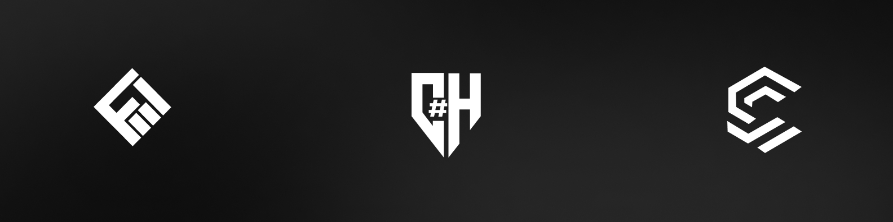

# Javid Hajiyev Personal Portfolio Website
This website created by Codery Software team.
Faril Mammadov - @farildev - Front-end developer
Javid Hajiyev - @CavidH - Back-end developer 

# About Javid Hajiyev

Javid Hajiyev is a Software Developer with 2 years of experience. 2+ years of C# experience and 1 year of work experience in this field. Currently, he works as CTO and Software Developer in Codery Software team. 

Github Profile Link : <a href="https://github.com/CavidH">Github</a>
Linkedin Profile Link : <a href="https://www.linkedin.com/in/cavid-hc/">Linkedin</a>
Instagram Profile Link : <a href="https://www.instagram.com/javid_hc/">Instagram</a>

This website designed by Faril Mammadov.

